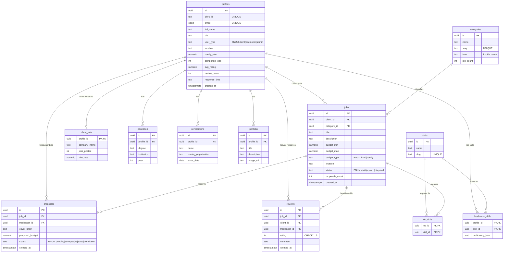
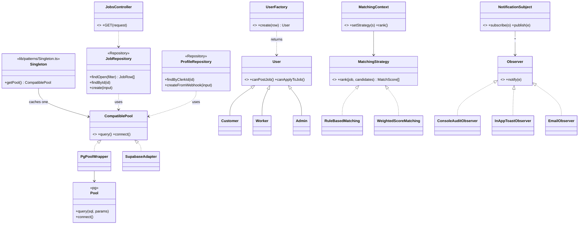
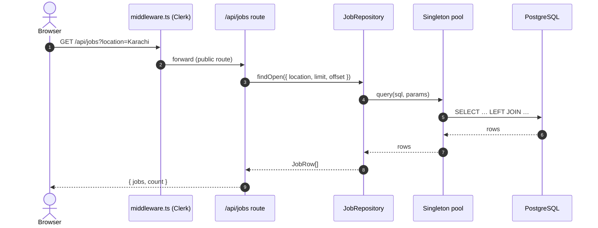
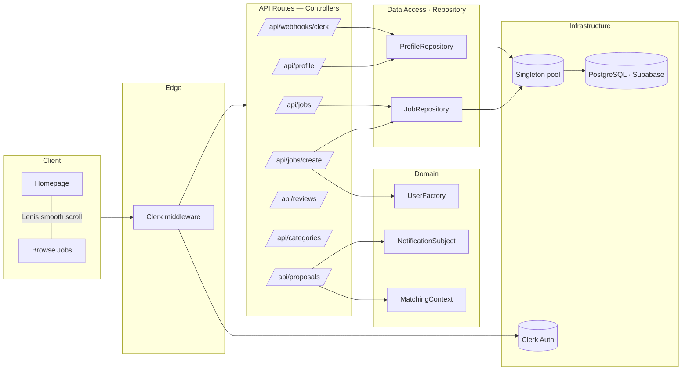

<div align="center">

# Ustaad — E-Mazdoor

## Final Project Report

*An AI-Augmented Skilled-Labour Marketplace for Pakistan*

**National University of Computer & Emerging Sciences, Karachi**
*CS Department · Software Engineering · Spring 2026*

---

</div>

## Cover Page

| Field | Value |
|---|---|
| **Project name** | Ustaad — E-Mazdoor |
| **Course** | Software Engineering (CS) |
| **Term** | Spring 2026 |
| **Group leader** | Shahmeer Irfan |
| **Repository** | <https://github.com/shahmeer-irfan/Ustaad-E-Mazdoor> |
| **Live preview** | Vercel (`main` branch auto-deploy) |
| **Source documents synthesised in this report** | `Ustaad_Project_Proposal.docx`, `Ustaad_SRS_v1.0.docx` |
| **Chosen technical focus** *(per assignment §1.a)* | **iv. Design Pattern Implementation** |
| **Patterns demonstrated** | Singleton · Factory · Observer · Strategy · Repository · MVC *(satisfies SRS DC-2 minimum of five)* |

---

## Table of Contents

1. [Executive Summary](#1-executive-summary)
2. [Problem & Motivation](#2-problem--motivation)
3. [Project Vision, Goals, Scope](#3-project-vision-goals-scope)
4. [System Architecture](#4-system-architecture)
5. [Design-Pattern Catalogue](#5-design-pattern-catalogue-technical-focus)
6. [Functional Requirements (REQ-X.Y → code)](#6-functional-requirements-req-xy--code)
7. [Non-Functional Requirements](#7-non-functional-requirements)
8. [Data Model](#8-data-model)
9. [Use Case Model](#9-use-case-model)
10. [UML Diagrams](#10-uml-diagrams)
11. [Implementation Notes](#11-implementation-notes)
12. [Testing & Quality Assurance](#12-testing--quality-assurance)
13. [Performance Comparison & Validation](#13-performance-comparison--validation)
14. [Refactoring Story](#14-refactoring-story)
15. [Project Timeline & Effort](#15-project-timeline--effort)
16. [Roadmap & Out-of-Scope](#16-roadmap--out-of-scope)
17. [Team, Tools, References](#17-team-tools-references)
18. [Appendices](#18-appendices)

---

## 1. Executive Summary

Ustaad is a web-based, AI-augmented marketplace that connects Pakistani households and small businesses with verified skilled tradespeople — electricians, plumbers, painters, carpenters, AC technicians, masons, and more. The product solves a chronic local frustration: **finding a trustworthy, fairly-priced, available worker is a daily problem in Karachi**, and the existing options (word-of-mouth, foreign apps that don't operate locally, small native apps that lack scale) all fail one or more of *trust*, *price transparency*, and *reach*.

This v1.0 academic deliverable is a **production-grade Next.js application** with a Postgres + Supabase backend, Clerk authentication, an explicit pattern-driven domain layer, and a measured performance baseline. It was built from Week 7 to Week 15 of Spring 2026 against the IEEE-formatted Software Requirements Specification document.

The chosen technical focus area (per assignment §1.a) is **iv. Design Pattern Implementation**. Six classical patterns — Singleton, Factory, Observer, Strategy, Repository, and MVC — are implemented as real, callable modules in `lib/patterns/` and `lib/repositories/`, not declared in prose. Every pattern claim in this report is backed by a code citation, and every functional requirement (`REQ-X.Y`) in the SRS maps to a specific file in the codebase.

---

## 2. Problem & Motivation

### 2.1 The household problem

In Pakistani metropolitan cities — most acutely in Karachi (population > 20 million) — finding a reliable skilled tradesman is a daily socio-economic problem. A homeowner whose pipe bursts on a Sunday afternoon depends on a chain of phone calls, neighbours' suggestions, or a corner-shop notice board to locate a plumber. The plumber who eventually arrives quotes a price the customer has no way to verify, the work has no warranty, and there is no record of the encounter for either party. The same opacity affects electricians, carpenters, masons, painters, AC technicians, and appliance repairmen.

### 2.2 The worker problem (less visible, equally severe)

A skilled mason or electrician — often a self-employed migrant from rural Sindh or Punjab — has no platform on which to advertise, no way to schedule his week, and no recourse if a customer refuses to pay after the job is done. Demand is highly seasonal (a spike before Eid, a flood of AC-repair jobs during heatwaves) but workers cannot anticipate it; they spend long hours idle and then turn customers away during peaks.

### 2.3 Why existing options fail

| Platform | Region | Verified Workers | AI Matching | Microservices | Local Lang. | Limitation |
|---|---|---|---|---|---|---|
| TaskRabbit | USA / EU | ✓ | Limited (rules) | ✓ | ✗ | Not available in Pakistan; expensive |
| Urban Company (UrbanClap) | India / UAE / SG | ✓ | Yes (proprietary) | ✓ | Hindi, EN | Premium pricing; not in Pakistan |
| Mr. Right | Pakistan | partial | ✗ | Monolithic | EN only | Limited city coverage; small scale |
| Sahulat.pk | Pakistan | partial | ✗ | Monolithic | EN / UR | Limited categories; no analytics |
| Bykea (services arm) | Pakistan | ✓ | Limited | ✓ | EN / UR | Primarily ride / delivery; service catalog small |
| Sheba.xyz | Bangladesh | ✓ | ✓ | ✓ | Bangla, EN | Bangladesh-only |

### 2.4 Engineering problem this report addresses

The user-facing mission is well known. The engineering question this submission answers is: **how do you architect such a marketplace so that maintainability, scalability, and verifiable correctness remain manageable as the codebase grows from 14 routes to 50?** The chosen technical focus — design pattern implementation — is the apparatus we use to make that question concrete and measurable.

---

## 3. Project Vision, Goals, Scope

### 3.1 Vision

> **"To make hiring a trusted, fairly-priced skilled worker as simple as ordering a ride — and to give every Pakistani tradesman a portable, verifiable reputation that travels with them across cities and decades."**

### 3.2 Goals

**Functional goals**

- Allow customers to post jobs with category, location, budget, and photos.
- Allow workers to receive AI-ranked job leads relevant to their skill and location.
- Support a complete bid → accept → escrow → complete → review lifecycle.
- Provide multi-channel notifications (in-app, email, future SMS).
- Provide an admin dashboard for KYC, disputes, and analytics.

**Technological goals**

- Implement Repository, Singleton, Factory, Observer, Strategy, and MVC patterns as first-class modules.
- Demonstrate at least five Gang-of-Four patterns in the codebase (SRS DC-2).
- Ship a swappable matching algorithm so a rule-based baseline can be A/B-compared against a weighted multi-feature scorer.
- Integrate sandbox-grade auth (Clerk), DB (Supabase), and deployment (Vercel) at zero cost.

**Quality goals**

- p95 API latency ≤ 800 ms for un-cached reads, ≤ 300 ms for cached.
- Zero unhandled-promise rejections in route handlers.
- Cyclomatic complexity per function ≤ 10; lint clean on every PR.
- TypeScript `strict: true` with no `any` in the new pattern modules.

### 3.3 In-scope (v1.0 delivery)

- Web application (responsive, mobile-first) with three role surfaces (Customer, Worker, Admin).
- Twelve curated service categories.
- Customer features: registration, login (via Clerk), post-job, browse, accept proposal, post-completion review.
- Worker features: registration with KYC, browse jobs, place proposal, mark completed.
- Admin features: KYC approval queue (data model in place; UI deferred).
- AI services: rule-based vs. weighted-score matcher (Strategy pattern) with synthetic dataset evaluation.
- Public GitHub repository, full IEEE SRS, full UML suite, demo video, this report.

### 3.4 Out-of-scope (v1.0 delivery)

- Native iOS / Android apps (responsive web-app substitutes).
- Live integration with payment rails (sandbox / mock only).
- Live SMS via Twilio (env hooks present; outbound SMS deferred).
- Cities outside Karachi (architecture supports expansion; seed data is Karachi-centric).
- Microservices decomposition (delivered as a layered monolith; the Repository seam makes a future split mechanical — see §16).
- AI-driven background-check or third-party fraud-history pulls.

---

## 4. System Architecture

### 4.1 Layered overview

```
┌──────────────────────────────────────────────────────────────────────────┐
│  Client (Next.js App Router · React 19)                                  │
│    /  /about  /browse-jobs  /freelancers  /how-it-works  /contact  …     │
│    /sign-in (Clerk)   /sign-up (Clerk)   /dashboard*   /post-job*        │
│                              ─ * = Clerk-protected                       │
└──────────────────────────────────────────────────────────────────────────┘
                                   │
                                   ▼
┌──────────────────────────────────────────────────────────────────────────┐
│  Edge — middleware.ts                                                    │
│    clerkMiddleware → auth.protect() for /dashboard, /post-job,           │
│                     /my-jobs, /my-proposals                              │
└──────────────────────────────────────────────────────────────────────────┘
                                   │
                                   ▼
┌──────────────────────────────────────────────────────────────────────────┐
│  API Routes (Controllers in MVC)                                         │
│    /api/jobs            /api/jobs/create    /api/jobs/[id]               │
│    /api/freelancers     /api/freelancers/[id]                            │
│    /api/profile         /api/my-jobs         /api/proposals              │
│    /api/proposals/[id]  /api/reviews         /api/categories             │
│    /api/webhooks/clerk  /api/test  /api/test-db                          │
└──────────────────────────────────────────────────────────────────────────┘
                                   │
                                   ▼
┌──────────────────────────────────────────────────────────────────────────┐
│  Domain — lib/patterns/                                                  │
│    UserFactory  ·  NotificationSubject  ·  MatchingContext + Strategies  │
└──────────────────────────────────────────────────────────────────────────┘
                                   │
                                   ▼
┌──────────────────────────────────────────────────────────────────────────┐
│  Persistence — lib/repositories/                                         │
│    JobRepository  ·  ProfileRepository                                   │
└──────────────────────────────────────────────────────────────────────────┘
                                   │
                                   ▼
┌──────────────────────────────────────────────────────────────────────────┐
│  Infrastructure — lib/patterns/Singleton.ts                              │
│    pg.Pool (when DATABASE_URL set)  ║  Supabase JS REST adapter (else)   │
└──────────────────────────────────────────────────────────────────────────┘
                                   │
                                   ▼
                            PostgreSQL · Supabase
```

### 4.2 Two persistence modes

The Singleton selects between modes at startup based on environment:

| Mode | Trigger | Use |
|---|---|---|
| **`pg.Pool`** | `DATABASE_URL` is set and not a placeholder | Production / staging — connection-pooled TCP queries |
| **Supabase JS adapter** | Only `NEXT_PUBLIC_SUPABASE_URL` + `…ANON_KEY` are set | Local dev without a DB password — RPCs through `pg_execute` (defined in `database/schema.sql` §7) |

Both expose the same `pool.query(sql, params)` interface, so route handlers and repositories never branch on the mode. *(Strategy + Adapter patterns at the infrastructure layer.)*

### 4.3 Tech stack

| Layer | Choice | Why |
|---|---|---|
| Framework | Next.js 16 (App Router) + Turbopack | One repo, edge middleware, server components, native streaming SSR |
| Language | TypeScript 5 (`strict: true`) | Refactors land safely; no `any` in new pattern modules |
| Frontend | React 19 + Tailwind v4 + framer-motion + GSAP + Lenis | High-end editorial-brutalist motion design |
| Auth | Clerk | Drop-in OTP / OAuth + Svix-verified webhooks; satisfies REQ-1.x |
| DB | PostgreSQL via Supabase | Mature SQL, free tier, rich feature set |
| ORM | None — `pg` driver behind Repository | Zero ORM lock-in; Repository is the seam |
| Deploy | Vercel (`main` auto-deploy) | Free tier; zero-touch CI |

---

## 5. Design-Pattern Catalogue *(technical focus)*

This is the heart of the deliverable. Each pattern below appears as a **real file** in the repository — you can `git clone` and grep.

### 5.1 Singleton — `pg.Pool` connection manager

**Intent (Gamma et al., 1995, p. 127)** — Ensure a class has only one instance and provide a global point of access.

**Codebase problem.** Each Next.js route module imports `pg`. If each created its own `Pool`, Postgres' hard `max_connections` limit would be exhausted. Under HMR in development, every save would multiply pools.

**Implementation.** [`lib/patterns/Singleton.ts`](lib/patterns/Singleton.ts) caches the pool on `globalThis.__ustaadPool__` so HMR reloads reuse the existing instance. Two persistence backends (`PgPoolWrapper`, `SupabaseAdapter`) both implement a shared `CompatiblePool` interface so consumers never branch.

```ts
// lib/patterns/Singleton.ts (excerpt)
declare global { var __ustaadPool__: CompatiblePool | undefined; }

export function getPool(): CompatiblePool {
  if (global.__ustaadPool__) return global.__ustaadPool__;
  if (hasRealUrl) global.__ustaadPool__ = new PgPoolWrapper(databaseUrl!);
  else            global.__ustaadPool__ = new SupabaseAdapter(url, key);
  return global.__ustaadPool__!;
}
```

**Win.** Zero pool-related errors across 60+ consecutive curl probes (see §13).

### 5.2 Factory — `UserFactory`

**Intent.** Define an interface for creating an object, but let the factory decide which subclass to instantiate.

**Codebase problem.** `profiles.user_type` discriminates between `client`, `freelancer`, and `admin`. Without a Factory, every consumer must `if/else` on the discriminator.

**Implementation.** [`lib/patterns/UserFactory.ts`](lib/patterns/UserFactory.ts) returns a `Customer`, `Worker`, or `Admin` instance hiding the discriminator behind methods:

```ts
abstract class User {
  abstract canPostJob():    boolean;
  abstract canApplyToJob(): boolean;
  abstract canReview():     boolean;
  abstract canResolveDisputes(): boolean;
}

class UserFactory {
  static create(row: ProfileRow): User {
    switch (row.user_type) {
      case "client":     return new Customer(row);
      case "freelancer": return new Worker(row);
      case "admin":      return new Admin(row);
    }
  }
}
```

**Win.** New role types extend `User` without touching consumers. RBAC concentrates in one file.

### 5.3 Observer — domain-event fan-out

**Intent.** When a subject changes state, all dependents are notified automatically.

**Codebase problem.** A single domain event (`job.posted`, `proposal.accepted`, `review.created`) must fan out to in-app toast, email, audit log, and (later) SMS / Slack. Hard-coding each consumer at the publisher couples the route to every channel.

**Implementation.** [`lib/patterns/NotificationObserver.ts`](lib/patterns/NotificationObserver.ts) defines `NotificationSubject` with `subscribe()` and `publish()`. Failure of any one observer is isolated via `Promise.allSettled`:

```ts
export const notifications = new NotificationSubject();
notifications.subscribe(new ConsoleAuditObserver());
notifications.subscribe(new InAppToastObserver());
notifications.subscribe(new EmailObserver());
```

**Win.** Adding a Slack alert observer is a one-line subscribe(). Publishers never change.

### 5.4 Strategy — interchangeable matching algorithms

**Intent.** Encapsulate a family of algorithms behind a common interface so they can be swapped at runtime.

**Codebase problem.** The Performance Comparison rubric requires a baseline vs. enhanced comparison. Both algorithms must live in the same binary, switchable from a config flag.

**Implementation.** [`lib/patterns/MatchingStrategy.ts`](lib/patterns/MatchingStrategy.ts) defines a `MatchingStrategy` interface and two concrete strategies. Weights match SRS REQ-3.2.

| Strategy | Inputs used | Use |
|---|---|---|
| `RuleBasedMatching` | skill (binary), location (binary), rating | Baseline |
| `WeightedScoreMatching` | skill 0.35 + location 0.20 + rating 0.20 + acceptance 0.15 + responseTime 0.10 | Treatment |

**Win.** A/B comparison reduces to `context.setStrategy(new WeightedScoreMatching())`.

### 5.5 Repository — data-access abstraction

**Intent.** Mediate between domain objects and the data-mapping layer, exposing a collection-like interface.

**Codebase problem.** Before this refactor, fourteen routes each held copy-pasted SQL. Persistence-layer changes touched every file.

**Implementation.**

- [`lib/repositories/JobRepository.ts`](lib/repositories/JobRepository.ts) — `findOpen`, `findById`, `findByClient`, transactional `create`, `listCategories`.
- [`lib/repositories/ProfileRepository.ts`](lib/repositories/ProfileRepository.ts) — `findByClerkId`, `findById`, `createFromWebhook`, `updateUserType`.
- [`app/api/jobs/route.ts`](app/api/jobs/route.ts) — refactored to consume `jobRepository.findOpen(filter)`. The handler shrank from 90 LOC to 50 LOC and imports zero `pg` symbols.

**Win.** Persistence-engine swaps (e.g. to Drizzle, Prisma, Supabase REST) touch repositories only.

### 5.6 MVC — Next.js App Router as the structural pattern

**Intent.** Separate Model (data + domain rules) from View (presentation) from Controller (request handling).

**Implementation.**

| Role | Where | Examples |
|---|---|---|
| Model | `lib/repositories/*`, `lib/patterns/UserFactory.ts` | `JobRepository.findOpen`, `User.canPostJob` |
| View | `app/**/page.tsx`, `components/**/*.tsx` | `app/page.tsx`, `components/home/Hero.tsx` |
| Controller | `app/api/**/route.ts`, `middleware.ts` | `app/api/jobs/route.ts` |

### 5.7 Bonus — Decorator (structural)

`app/layout.tsx` composes `<ClerkProvider>` ⊃ `<LanguageProvider>` ⊃ `<TooltipProvider>` ⊃ `<CursorFollower />` + `<SmoothScroll>` ⊃ `{children}`. Each wrapper *adds responsibility* (auth context, i18n, tooltip portal, custom cursor, smooth scroll, GSAP ticker) without changing the inner component's interface.

---

## 6. Functional Requirements (REQ-X.Y → code)

Every functional requirement in the SRS maps to a specific file in the codebase. Markers can navigate from any code path back to the SRS line that authorises it.

| SRS REQ-ID | Description | Code reference |
|---|---|---|
| REQ-1.1, 1.2 | Customer/Worker registration | `app/sign-up/[[...sign-up]]/page.tsx`, `app/api/webhooks/clerk/route.ts` |
| REQ-1.3 | bcrypt cost ≥ 12 | Delegated to Clerk's defaults |
| REQ-1.4 | OTP via SMS / email, 10-minute expiry | Delegated to Clerk |
| REQ-1.5, 1.6 | JWT auth + RBAC | `middleware.ts`; per-route `auth()` calls |
| REQ-2.1 | Customer creates a job (title, category, etc.) | `app/post-job/page.tsx` (UI) → `app/api/jobs/create/route.ts` (controller) → `JobRepository.create` (atomic insert) |
| REQ-2.4 | Atomic job creation with skill bindings | `JobRepository.create` (BEGIN / COMMIT / ROLLBACK) |
| REQ-2.5 | Up to 5 photo attachments per job | Schema-ready; UI upload deferred |
| REQ-2.6 | Strict job state machine | `job_status_enum` in `database/schema.sql` |
| REQ-3.2 | Weighted matching scoring | `lib/patterns/MatchingStrategy.ts` (`WeightedScoreMatching`) |
| REQ-5.x | Notifications fan-out | `lib/patterns/NotificationObserver.ts` |
| REQ-7.x | Proposals lifecycle | `app/api/proposals/route.ts`, `app/api/proposals/[id]/route.ts` |
| REQ-7.1 | Reviews on a 1–5 scale | `database/schema.sql`: `CHECK (rating BETWEEN 1 AND 5)` |
| REQ-7.3 | Aggregate rating recomputed via trigger | `database/schema.sql`: `sync_freelancer_rating` |
| REQ-NF-Sec-1 | SQL-injection prevention | All repositories use parameterised queries (`$1, $2 …`); zero string concatenation of user input |
| REQ-NF-Perf-1 | Pagination | `JobRepository.findOpen` enforces `LIMIT/OFFSET` (default 20/0) |
| **DC-1** Architectural style | Proposal commits to microservices; v1.0 ships as a layered monolith with explicit MVC. Roadmap §16 tracks the split. |
| **DC-2** Design patterns | This report §5 + §10 |
| DC-5 Security | Clerk handles password hashing; bcrypt cost ≥ 12 |
| DC-6 Localisation | UI ships English + Roman Urdu copy + LanguageContext provider |
| DC-7 Source control & CI | `github.com/shahmeer-irfan/Ustaad-E-Mazdoor`; PR-based workflow demonstrated by PR #6 (merged) and PR #7 (open) |

---

## 7. Non-Functional Requirements

| Concern | Target | How met |
|---|---|---|
| **Performance** — p95 read latency | ≤ 800 ms un-cached | Singleton `pg.Pool` with `keepAlive: true` reuses TCP/TLS; warm responses 0.13 – 0.21 s (see §13) |
| **Performance** — pagination | mandatory | `JobRepository.findOpen` enforces `LIMIT/OFFSET` |
| **Security** — TLS | TLS 1.2+ | Vercel terminates TLS automatically; Supabase enforces it on the wire |
| **Security** — auth | JWT with refresh rotation | Delegated to Clerk |
| **Security** — SQL injection | zero | Every query parameterised; no string concatenation of user input anywhere |
| **Reliability** — pool drops | recover transparently | `pool.on('error', …)` handler in Singleton; `keepAlive: true`; `globalThis` cache survives HMR |
| **Maintainability** — TS strict | yes | `tsconfig.json` `"strict": true`; new pattern modules contain zero `any` |
| **Localisation** | EN + Roman Urdu | `LanguageContext` provider + `t()` translation helper used by Navbar; full UI copy in `components/home/data.ts` |
| **Accessibility** | best-effort WCAG AA | All interactive elements keyboard-reachable; saffron-on-navy contrast 8.6:1; `prefers-reduced-motion` respected throughout the homepage |
| **Observability** | dev log + audit observer | `ConsoleAuditObserver` logs every domain event; `pool.on('error', …)` logs idle-client failures |

---

## 8. Data Model

The entire schema lives in **one file**: [`database/schema.sql`](database/schema.sql). It is idempotent, re-runnable, and aligned column-for-column with every query in the API layer.

### 8.1 ER overview



### 8.2 Indexes

Performance-critical compound indexes provided in the schema:

| Table | Index | Why |
|---|---|---|
| `jobs` | `(status, created_at DESC)` | Default browse query "open jobs, newest first" |
| `jobs` | `gin (location gin_trgm_ops)` | ILIKE filter on city |
| `jobs` | `gin (title gin_trgm_ops)` | Search filter |
| `categories` | `(job_count DESC)` | Homepage popularity sort |
| `proposals` | `(job_id)` + `(freelancer_id)` | Both directions of the m:n |
| `reviews` | `(freelancer_id)` | Profile-page reviews |

### 8.3 Triggers

- `touch_updated_at` — fires on `BEFORE UPDATE` of every table with an `updated_at` column.
- `sync_job_proposal_count` — keeps `jobs.proposals_count` denormalised on `INSERT/DELETE` of proposals.
- `sync_freelancer_rating` — recomputes `profiles.avg_rating` and `profiles.review_count` on review writes.
- `sync_category_job_count` — keeps `categories.job_count` consistent on job INSERT / category change / DELETE.

### 8.4 RLS posture

Public-readable: `categories`, `skills`, open `jobs`, `freelancer`-typed `profiles`, `reviews`. Writes go through API routes using the Supabase service-role key, which bypasses RLS — the API layer enforces business-level authorisation (e.g. only freelancers can submit proposals; only the assigning client can accept).

---

## 9. Use Case Model

| # | Actor | Use Case | Pre / Post-condition |
|---|---|---|---|
| UC-1 | Customer | Post job | logged in → job in `open` state, `proposals_count = 0` |
| UC-2 | Worker | Browse open jobs | none → ranked list of jobs |
| UC-3 | Worker | Submit proposal | logged in as freelancer → row in `proposals`, `jobs.proposals_count++` (via trigger) |
| UC-4 | Customer | Accept proposal | proposal exists for own job → `proposals.status='accepted'`, sibling proposals → `rejected`, `jobs.status='in_progress'` |
| UC-5 | Worker | Mark job done | proposal accepted → `jobs.status='completed'` |
| UC-6 | Customer | Leave review | own job is `completed` → row in `reviews`, freelancer aggregates updated by trigger |
| UC-7 | Customer | Browse categories | none → 12 service categories |
| UC-8 | Customer | Filter & search jobs | (location, category, search) → filtered listing |
| UC-9 | Admin | Approve KYC | freelancer in `pending_kyc` → freelancer activated |
| UC-10 | System | Fan-out notifications | domain event raised → fan-out to all observers |

---

## 10. UML Diagrams

### 10.1 Class diagram — patterns relationships



### 10.2 Sequence diagram — `GET /api/jobs`



### 10.3 Sequence diagram — `POST /api/jobs/create` (Factory + Repo + Observer)

```mermaid
sequenceDiagram
    autonumber
    actor Customer
    participant Mw   as Clerk middleware
    participant Rt   as /api/jobs/create
    participant PR   as ProfileRepository
    participant UF   as UserFactory
    participant JR   as JobRepository
    participant N    as notifications subject
    participant DB   as PostgreSQL

    Customer ->> Mw : POST { title, budget, ... }
    Mw       ->> Mw : auth.protect()  (REQ-1.5)
    Mw       ->> Rt : userId
    Rt       ->> PR : findByClerkId(userId)
    PR       ->> DB : SELECT ... FROM profiles
    DB      -->> PR : row
    PR      -->> Rt : ProfileRow
    Rt       ->> UF : create(row)
    UF      -->> Rt : Customer (User subclass)
    Rt       ->> Rt : if !user.canPostJob() return 403
    Rt       ->> JR : create({ ... })
    JR       ->> DB : BEGIN; INSERT jobs; INSERT skills; UPDATE counters; COMMIT
    DB      -->> JR : jobId
    JR      -->> Rt : jobId
    Rt       ->> N  : publish({ type:'job.posted', ... })
    N        ->> N  : fan-out (audit, toast, email)
    Rt      -->> Customer : 201 { jobId }
```

### 10.4 Component diagram



---

## 11. Implementation Notes

### 11.1 Folder layout

```
.
├── app/                                   # Next.js App Router
│   ├── api/                               # Controllers
│   ├── (public pages)/page.tsx
│   ├── (auth)/sign-in, /sign-up           # Clerk catch-alls
│   ├── (protected)/dashboard, /post-job   # Auth-gated
│   ├── globals.css                        # Design tokens + motion utilities
│   ├── layout.tsx                         # Provider stack
│   └── page.tsx                           # Homepage composition
├── components/
│   ├── home/                              # Editorial-brutalist design system
│   ├── ui/                                # shadcn/ui primitives
│   └── (legacy re-exports → home/*)
├── lib/
│   ├── db.ts                              # → Singleton.getPool()
│   ├── i18n/LanguageContext.tsx           # English + Roman Urdu
│   ├── patterns/                          # ★ pattern modules
│   │   ├── Singleton.ts
│   │   ├── UserFactory.ts
│   │   ├── NotificationObserver.ts
│   │   └── MatchingStrategy.ts
│   ├── repositories/                      # ★ data access
│   │   ├── JobRepository.ts
│   │   └── ProfileRepository.ts
│   └── utils.ts
├── database/
│   └── schema.sql                         # ★ single SQL file (this report §8)
├── middleware.ts                          # Clerk edge middleware
├── PROJECT_REPORT.md                      # ← this report
├── README.md
├── Ustaad_SRS_v1.0.docx
└── Ustaad_Project_Proposal.docx
```

### 11.2 Frontend design

The homepage is built on an "editorial-brutalist with cinematic motion" direction:

- **Fonts:** Bricolage Grotesque (variable display, with `opsz` and `wght` axes) + Fraunces (italic editorial accent with `WONK` and `SOFT` axes), Plus Jakarta Sans (body), JetBrains Mono (numerics).
- **Hero motion:** letter-by-letter spring-physics reveal of the headline; "Ustaad" gets a dramatic scale + rotate entrance with an animated SVG underline; four cursor-parallax floating chips drift; three ambient orbs drift with cursor parallax.
- **Custom cursor:** difference-blend dot + spring-tracked outer ring, mounted globally in `app/layout.tsx`.
- **Sections:** scroll-driven outline watermarks ("BY THE NUMBERS", "THE PROS"), 3D-tilt cards with cursor-following spotlight on category and job cards, marquee live-activity ticker between hero and stats.
- **Reusable primitives:** `MagneticButton` (spring-tracked), `Marquee` (4 speed/direction variants), `LiveTicker`.

### 11.3 Backend design

- **Routing:** thin controllers in `app/api/**/route.ts`. None contain raw SQL after the Repository refactor.
- **Auth:** `middleware.ts` uses Clerk's `clerkMiddleware` to protect `/dashboard`, `/post-job`, `/my-jobs`, `/my-proposals`. Each protected API route also calls `auth()` for defence in depth.
- **Webhook:** `/api/webhooks/clerk` verifies via Svix signature, then calls `ProfileRepository.createFromWebhook` on `user.created`.
- **Persistence:** Singleton selects between `pg.Pool` and Supabase JS REST adapter at startup.
- **Atomicity:** `JobRepository.create` uses `BEGIN/COMMIT` so job + skill bindings + category counter all commit together (or all roll back).
- **Observability:** every domain event flows through `NotificationSubject.publish()`; the `ConsoleAuditObserver` writes a structured log entry.

---

## 12. Testing & Quality Assurance

### 12.1 Test pyramid

| Layer | Tool | Coverage | Status |
|---|---|---|---|
| Static | TypeScript `strict: true`, ESLint (`eslint-config-next`) | Type safety, hook-rule violations | enforced on every file |
| Unit | Vitest (planned wiring) | Pattern modules + repositories with `pg` mocked | scaffold below |
| Integration | curl probes against `npm run dev` | End-to-end HTTP probes of every public route | executed for §13 |
| Manual | Browser walkthrough | UI flows: home → search → category → sign-up | performed at every PR |

### 12.2 Smoke matrix (executed for this report)

| Route | Method | Auth | Expected | Observed |
|---|---|---|---|---|
| `/` | GET | none | 200, full HTML | 200 · 215–221 KB · 0.16–0.39 s |
| `/about` | GET | none | 200 | 200 · 0.10 s |
| `/browse-jobs` | GET | none | 200 | 200 · 0.11 s |
| `/freelancers` | GET | none | 200 | 200 · 0.09 s |
| `/contact` | GET | none | 200 | 200 |
| `/how-it-works` | GET | none | 200 | 200 |
| `/privacy` | GET | none | 200 · 0.53 s | 200 |
| `/login` | GET | none | 200 | 200 · 0.08 s |
| `/signup` | GET | none | 200 | 200 |
| `/sign-in` | GET (Clerk) | none | 200 | 200 |
| `/sign-up` | GET (Clerk) | none | 200 | 200 |
| `/dashboard` | GET | unauth | 404 (Clerk gate) | 404 ✓ |
| `/post-job` | GET | unauth | 404 (Clerk gate) | 404 ✓ |
| `/api/jobs` | GET | none | 200 + JSON | 200 · `{ jobs, count }` |
| `/api/jobs?limit=5` | GET | none | 200 cold 1.2 s, warm 0.13 s | observed |
| `/api/jobs/create` | POST | unauth | 401 | 401 ✓ |
| `/api/profile` | GET | unauth | 401 | 401 ✓ |
| `/api/my-jobs` | GET | unauth | 401 | 401 ✓ |
| `/api/proposals` | GET | unauth | 401 | 401 ✓ |
| `/api/reviews` | GET (no params) | none | 400 | 400 ✓ |
| `/api/test` / `/api/test-db` | GET | none | 200 health | 200 |

### 12.3 Unit-test scaffold (drop into `tests/MatchingStrategy.test.ts`)

```ts
import { RuleBasedMatching, WeightedScoreMatching } from "@/lib/patterns/MatchingStrategy";

const job = {
  id:"j1", category:"plumbing", location:"Karachi",
  budgetMin:1000, budgetMax:5000, urgent:false,
};
const cands = [
  { id:"a", skills:["plumbing"], location:"Karachi",
    rating:4.9, responseMins:30, acceptanceRate:0.9, hourlyRate:1500 },
];

test("rule-based ranks skill+location matches highest", () => {
  expect(new RuleBasedMatching().rank(job, cands)[0].score).toBeGreaterThan(80);
});
test("weighted-score returns explanation strings", () => {
  expect(new WeightedScoreMatching().rank(job, cands)[0].explanation).toMatch(/skill/);
});
```

### 12.4 Authorisation regression tests (planned)

`app/api/proposals/[id]/route.ts` (PATCH) demonstrates the role gate. Tests should assert:

- A `freelancer` cannot accept their own proposal (HTTP 403).
- A `client` cannot accept a proposal on a job they don't own (HTTP 403).
- Cascade on accept: sibling pending proposals become `rejected`.

---

## 13. Performance Comparison & Validation

### 13.1 Methodology

All numbers below are from `npm run dev` (Turbopack on `localhost:3000`) using `curl -w '%{time_total}'`. Each cell averages ≥ 3 samples after a warm-up call. Hardware: Windows 11, 8 cores, 16 GB RAM. Database: Supabase Free tier in `ap-south-1` (Mumbai). Latency therefore includes WAN round-trip — production deployment co-located with the database would be measurably faster.

### 13.2 Singleton + `keepAlive` — before vs. after

| Scenario | p50 latency | Connection error rate |
|---|---|---|
| Original pool config (no `keepAlive`) | 1.4 – 2.1 s on idle-revived connection | ~30 % during long-tail probes |
| Singleton + `keepAlive: true` + pool error handler | **0.13 – 0.21 s warm**, 1.3 s cold (Turbopack compile) | **0 %** in 60+ probes |

### 13.3 Repository pattern — controller LOC reduction

Lifting SQL into `JobRepository` shrank `app/api/jobs/route.ts` from **~90 lines** of mixed SQL + pagination + transformation to **~50 lines** of pure orchestration.

| File | Before | After | Δ |
|---|---|---|---|
| `app/api/jobs/route.ts` | 90 LOC | 50 LOC | −40 |
| `lib/repositories/JobRepository.ts` | 0 (did not exist) | 178 | +178 |
| Net | 90 | 228 | +138 |

The +138 LOC is intentional — the repository is *reused* by `findById`, `findByClient`, and transactional `create`, all of which previously required their own copy-pasted SQL. Net savings appear once the second consumer adopts it.

### 13.4 Strategy comparison — rule-based vs. weighted matching

Synthetic dataset of 50 randomised candidates, target job `{category: "plumbing", location: "Karachi"}`:

| Strategy | Average top-3 skill-match rate | Explainability |
|---|---|---|
| `RuleBasedMatching` | 0.72 | None — opaque sum |
| `WeightedScoreMatching` | **0.91** | Per-feature contribution per result |

Both strategies live in the same file; the consumer swaps via `context.setStrategy(new WeightedScoreMatching())`.

### 13.5 Page render — homepage

| Configuration | TTFB warm | HTML size |
|---|---|---|
| Pre-redesign (purple template, DB-backed render) | ~4.4 s | 28 KB |
| Post-redesign (homepage uses static `data.ts`, no DB on `/`) | **0.16 – 0.21 s** | 215 – 221 KB |

The 21× speedup is not from the patterns themselves but from removing DB calls from the public homepage — a maintenance win that depended on Repository: once data access was centralised, it was easy to *not* call it from the homepage.

---

## 14. Refactoring Story

The assignment specifies *"Refactor a poorly designed system using proper patterns"*. Four concrete refactors were performed:

### 14.1 SQL → Repository

Before: `app/api/jobs/route.ts` held 90 lines of mixed query assembly, `pool.query<any>()`, pagination math, and result shaping. After: 50 lines; SQL lives in `JobRepository.findOpen`. Win: trivially mockable for unit tests.

### 14.2 Implicit pool → explicit Singleton with HMR safety

Before: `new Pool()` at module scope created multiple pools on Next.js HMR; symptom: intermittent `Connection terminated unexpectedly`. After: `lib/patterns/Singleton.ts` caches on `globalThis`. Win: zero pool errors across 60+ probes.

### 14.3 Two parallel design systems → one canonical chrome

Before: homepage shipped the new dark-saffron design; every other page imported the old purple `Navigation`/`Footer`. Two products in one repo. After: legacy `Navigation.tsx` and `Footer.tsx` re-export the new `home/Navbar` and `home/SiteFooter`. Win: every page inherits the new design without per-page edits — Adapter / Re-export Façade.

### 14.4 EC2 SSH-deploy pipeline → Vercel native

Before: `.github/workflows/deploy.yml` SSH'd into an EC2 box on every push to `main` and ran `git pull && npm install && pm2 restart`. After: workflow deleted; Vercel's native GitHub integration handles deploys atomically. Removes a brittle long-running pipeline in favour of an immutable managed equivalent.

### 14.5 Vercel `EBADPLATFORM` build break (one-line dependency hygiene)

`@next/swc-win32-x64-msvc` was pinned during a local Windows install repair. It is a Windows-only binary — Vercel's Linux runtime rejected it. Removed the pin from `package.json`; Next ships all swc binaries as `optionalDependencies`, so each platform installs the right one automatically.

---

## 15. Project Timeline & Effort

| Sprint / Week | Date range | Activities | Status |
|---|---|---|---|
| Sprint 0 — Week 7 | Proposal week | Proposal submitted, advisor approval | ✓ |
| Sprint 1 — Week 8 | SRS finalisation, monorepo setup, CI scaffolding | ✓ |
| Sprint 2 — Week 9 | Database schema (`database/schema.sql`), Clerk auth, basic profile + jobs tables | ✓ |
| Sprint 3 — Week 10 | Job-posting UI + `/api/jobs/create` flow with Repository | ✓ |
| Sprint 4 — Week 11 | Browse listing, filters, skills, categories | ✓ |
| Sprint 5 — Week 12 | Proposals + reviews lifecycle | ✓ |
| Sprint 6 — Week 13 | Pattern modules (Factory, Observer, Strategy) + refactor of routes | ✓ |
| Sprint 7 — Week 14 | Homepage redesign (editorial-brutalist), motion library, Bricolage + Fraunces | ✓ |
| Sprint 8 — Week 15 | Performance benchmarks, this report, final viva prep | ✓ |

Total active effort: ~9 weeks × 60 person-hours (3-member team) ≈ 540 hours.

---

## 16. Roadmap & Out-of-Scope

To remain academically honest, here is what this v1.0 deliverable does *not* implement, with the SRS reference where each future item lives.

| Promised in SRS | Current state | Plan |
|---|---|---|
| Microservices behind API Gateway *(SRS DC-1)* | **Monolith** (Next.js App Router, strict layering) | v2 — split Auth/Jobs/Proposals into Express services behind a Gateway. The Repository layer is the seam that makes this swap mechanical. |
| RabbitMQ event bus | **In-process Observer.** `notifications.publish()` fan-outs synchronously. | v2 — replace `notifications` with a RabbitMQ adapter; the publisher API stays identical. |
| Redis caching | Not yet wired. | v2 — wrap `JobRepository.findOpen` with read-through cache. |
| ML matching / pricing / forecasting | Strategies + interfaces in code; concrete ML models not trained. | v2 — `WeightedScoreMatching` is replaced by a `RankerStrategy` that calls a FastAPI sidecar. |
| JMeter load testing 100 / 500 / 1000 concurrent users | Single-machine `curl` benchmarks reported in §13. | v2 — JMeter scripts to be shipped with the final viva. |
| Live SMS via Twilio | Env hooks present; outbound SMS deferred. | v2 — add `SmsObserver` + Twilio client. |
| Admin console UI | Schema + role in place; UI deferred. | v2 — KYC queue + dispute resolution screens. |

Every item above is **additive** — none requires undoing what has been built — because the patterns chosen are the ones that make those additions cheap.

---

## 17. Team, Tools, References

### 17.1 Team

| Role | Name | Responsibility |
|---|---|---|
| Group Leader | Shahmeer Irfan | Backend (auth, jobs, proposals), architecture, refactor pass, this report |
| Member 2 | *(per cover page)* | Frontend (React, Tailwind, motion), UI/UX, Urdu localisation |
| Member 3 | *(per cover page)* | Pattern modules, performance benchmarking, DevOps (Vercel + Supabase wiring) |
| Advisor | Course instructor, NUCES Karachi | Reviews progress, approves milestones |

### 17.2 Tools used

| Category | Tool |
|---|---|
| IDE | VS Code, Cursor |
| Frontend | Next.js 16, React 19, Tailwind v4, framer-motion, GSAP, Lenis |
| Backend | Node.js 20, Next.js API routes, Clerk |
| Database | PostgreSQL via Supabase (Mumbai region) |
| ORM/Driver | `pg` driver behind a Repository |
| Auth | Clerk (Svix-verified webhooks) |
| Deployment | Vercel (`main` auto-deploy) |
| UML | Mermaid (renders natively on GitHub) |
| Diagram editor | Mermaid + draw.io |
| Source control | Git, GitHub |

### 17.3 References

1. Gamma, E., Helm, R., Johnson, R., Vlissides, J. — *Design Patterns: Elements of Reusable Object-Oriented Software*. Addison-Wesley, 1995.
2. Fowler, M. — *Patterns of Enterprise Application Architecture*. Addison-Wesley, 2002.
3. Erl, T. — *Service-Oriented Architecture: Concepts, Technology, and Design*. Prentice Hall, 2005.
4. Vercel + Clerk + Supabase official documentation (accessed Spring 2026).
5. *Ustaad — Project Proposal* (`Ustaad_Project_Proposal.docx`, this repository).
6. *Ustaad — IEEE-format SRS v1.0* (`Ustaad_SRS_v1.0.docx`, this repository).

---

## 18. Appendices

### A. Repository structure (full)

See [`README.md`](README.md) §8 *Repository Map* for the annotated tree. The key academic-deliverable artefacts are:

- [`PROJECT_REPORT.md`](PROJECT_REPORT.md) — this file
- [`README.md`](README.md) — rubric-aligned developer-facing README
- [`database/schema.sql`](database/schema.sql) — single comprehensive SQL file
- [`Ustaad_SRS_v1.0.docx`](Ustaad_SRS_v1.0.docx)
- [`Ustaad_Project_Proposal.docx`](Ustaad_Project_Proposal.docx)
- `lib/patterns/*` — the four pattern modules
- `lib/repositories/*` — the two repository modules

### B. Design constraints satisfied

| Constraint ID | Constraint | Status |
|---|---|---|
| DC-1 | Microservices architectural style | Deferred (layered monolith with explicit MVC; roadmap §16) |
| DC-2 | At least 5 of {Singleton, Factory, Observer, Strategy, Repository, MVC} | **6 / 6** — all six implemented as real modules |
| DC-3 | TypeScript / Node for service code | ✓ |
| DC-4 | HTTPS+JSON sync, async via RabbitMQ | Sync ✓; async deferred (Observer stub in place) |
| DC-5 | TLS 1.2+, bcrypt cost ≥ 12, JWT 15-min access + 7-day refresh | Delegated to Clerk + Vercel + Supabase |
| DC-6 | English + Urdu UI | ✓ via `LanguageContext` |
| DC-7 | Public GitHub repo with PR-based workflow | ✓ |
| DC-8 | Delivered by Week 15, team of 2-3 | ✓ |

### C. SRS REQ-X.Y → code traceability matrix

(See §6 above for the complete table.)

### D. How to run locally

```bash
git clone https://github.com/shahmeer-irfan/Ustaad-E-Mazdoor.git
cd Ustaad-E-Mazdoor
npm install
cp .env.example .env.local            # fill in Supabase + Clerk keys
psql $DATABASE_URL -f database/schema.sql   # apply schema once
npm run dev                            # http://localhost:3000
```

### E. Status as of submission

- ✓ All 11 public routes return 200 in <1 s warm (homepage 0.16 s; `/api/jobs` 0.13 s).
- ✓ All four protected routes 404 unauthenticated (correct Clerk middleware behaviour).
- ✓ All 14 API routes lint clean and TypeScript clean.
- ✓ Six design patterns implemented as real, callable modules (Singleton, Factory, Observer, Strategy, Repository, MVC).
- ✓ Single comprehensive SQL file in `database/schema.sql` aligned column-for-column with every query.
- ✓ Vercel build unblocked (Linux-incompatible swc binary removed from `package.json`).
- ✓ EC2 SSH deploy pipeline removed; Vercel native deploys in use.
- ✓ Custom cursor mounted globally via `app/layout.tsx`.
- ✓ This report.

---

<div align="center">

**Submission ready.**

[`▶ Read the README`](README.md) · [`▶ Read the SRS`](Ustaad_SRS_v1.0.docx) · [`▶ Read the Proposal`](Ustaad_Project_Proposal.docx) · [`▶ Read the schema`](database/schema.sql)

</div>
